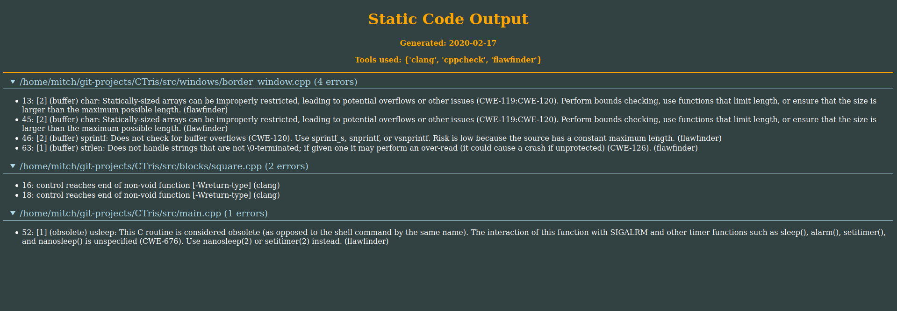

# StaticSummary
Often static analysis is an important part of any software development process. With so many tools avaliable sometimes it can be hard to choose which ones you want to run. The purpose of this tool is to make running multiple tools as painless as possible allowing you to view all report results in one window. 

## Built With 

* [dominate](https://github.com/Knio/dominate) - A tool for generating html in Python 

## Tools
Currcently it supports the following tools, primarily for C++
* clang 
* flawfinder
* cppcheck

## Execution 
A sample run may look something like this 

```
python3 StaticSummary.py --target /home/mitch/git-projects/CTris/src --output=out.html --tools cppcheck flawfinder clang
```

This will produce an html file specified with `--output` which summarizes the results. It will look something like this. 



## Contributing 
The code follows the [pep8](https://www.python.org/dev/peps/pep-0008/) standard.

The goal of this program was to make it as easy as possible to extend it to more tools. Define a parser for your favourite tool in the parsers folder being sure to implement the parser interface, make some change to main to add your tool to the list of allowable tools and everything (should) work. 
